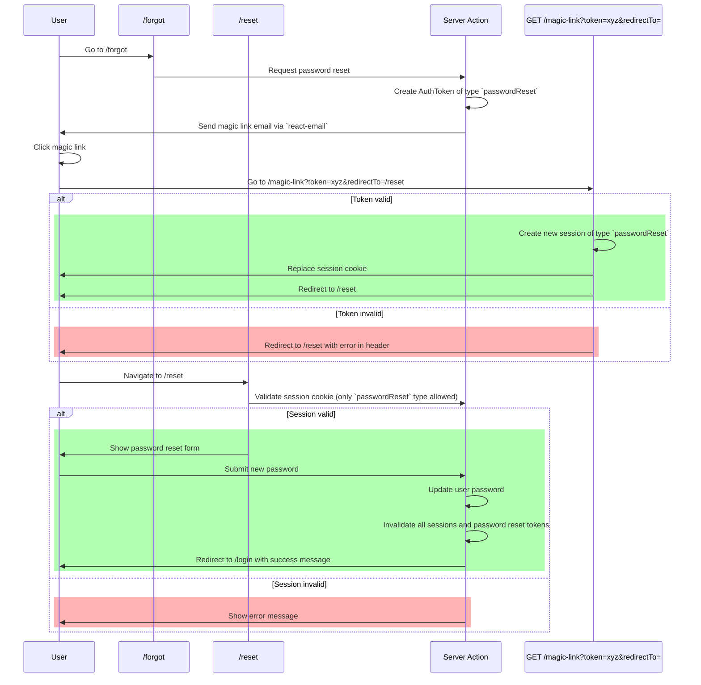

# Authentication

## General approach

We use `lucia` for authentication, a very lightweight authentication library that mostly just creates a light framework for managing sessions.

## Auth Tokens

Auth tokens are used to authenticate users.

They are used in two places:

-   The integrations, for legacy reasons.
-   /magic-link

Ideally, we do not need to think about auth tokens much as we are writing pages. The tokens get exchanged for sessions, which have a certain type (see below).

### Auth Token Types

There are a number of types of auth tokens.

Auth tokens of a specific type create sessions of the same type. Session types are used to determine which pages a user can access during a session. For instance, you would not want to be able to access the rest of the app from a password reset link. Vice versa, we do not want a user to be able to reset their password while being logged in, as that would allow anyone who has access to a session to be able to reset their password.

Pages are in control of which auth tokens/sessions they allow.

| 🏷️ **Type**            | 🔐 **Purpose**                                                                                                                     | 📅 **Status** |
| ---------------------- | ---------------------------------------------------------------------------------------------------------------------------------- | ------------- |
| **Generic**            | Authenticates a user the same way that a password does. Think of these as a magic-link, although they do not expire after one use. | ✅ In Use     |
| **Password Reset**     | authenticate user only for the purpose of resetting your password.                                                                 | ✅ In Use     |
| **Email Verification** | Not in use                                                                                                                         | ❌ Not in Use |
| **Signup**             | Not in use                                                                                                                         | ❌ Not in Use |

### Sessions

Sessions are, well, session.

Sessions also have a type, corresponding to the type of auth token that created them, or `generic` if they were created by a simple login.

### Diagrams

(these diagrams are experiments, let me know what style you prefer)

#### Password reset flow

##### Text version

The flow is as follows:

1. The user requests a password reset.
2. This triggers a server action in which
    1. An AuthToken of type `passwordReset` is created.
    2. We send the user an email with a magic link of format /magic-link?token=xyz&redirectTo=/reset using `react-email`.
3. The user clicks the magic link.
4. The user is taken to an API route /magic-link?token=xyz&redirectTo=/reset, in which
    1. We validate the token.
    2. If that happens succefully:
        1. We create a new session of the same type as the token, in this case `passwordReset`.
        2. We replace the current session cookie with a new session cookie.
        3. We redirect the user to the redirectTo URL.
    3. If that fails:
        1. We _still_ redirect the user to the redirectTo URL.
        2. We set a header on the response indicating why the token was invalid.
5. the user arrives at /reset.
6. A normal authentication check is performed against the session cookie, but only sessions of type `passwordReset` are valid. This ensures that `/reset` is only accessible to users who have requested a password reset.
7. The user enters their new password, and clicks submit.
8. This triggers another server action, which sets the user's password, invalidates every session of the user, and invalidates all password reset tokens.
9. The user is shown a success message, and is redirected to /login.

#### Form invite flow

```mermaid
flowchart TD
    A[Admin invites user to pub] --> B[Email is sent with magic link]
    B --> C[User clicks magic link]
    C --> |Directed to|D[ /magic-link?token=xyz&redirectTo=/c/slug/forms/public/xxx/fill]
    D --> E[Validate token]
    E --> |✅Valid token|F[Replace current session cookie with a new session cookie]
    F --> G[Set session cookie]
    G --> |Set session cookie|Reset


    E --> |❌Invalid token|Inv1[Set x-pubpub-invalid-token-reason header]

    Inv1-->Reset[Navigate to /fill]

    Reset-->Check[Check session cookie]



    Check--> |✅ Session is valid|Authz[Authorization check]

    Authz --> |User is superadmin|Filling
    Authz --> AuthMember[User is member of organization]
    AuthMember --> |User is admin|Filling
    AuthMember --> |User is editor or contributor|AuthPerm[Check whether user has permission to edit this form]

    AuthPerm --> |User has permission|Filling['🙏 User can fill out form']


AuthMember -->|❌ Invalid authorization|Fail
AuthPerm -->|❌ Invalid authorization|Fail

    Authz --> |❌ Invalid authorization|Fail["Show some authoriation fail state"]



    Check ---> |❌Session is not valid|Inv2[Check x-pubpub-invalid-token-reason header]
    Inv2-->|Token is invalid for some other reason|Invalid[Redirect to /not-found]

    Inv2-->|x-pubpub-invalid-token-reason header is 'expired'</br>indicating that token is expired|Expired[Redirect to /expired]

    Expired --> ReRe[User requests another token]

    ReRe ------> B

```

