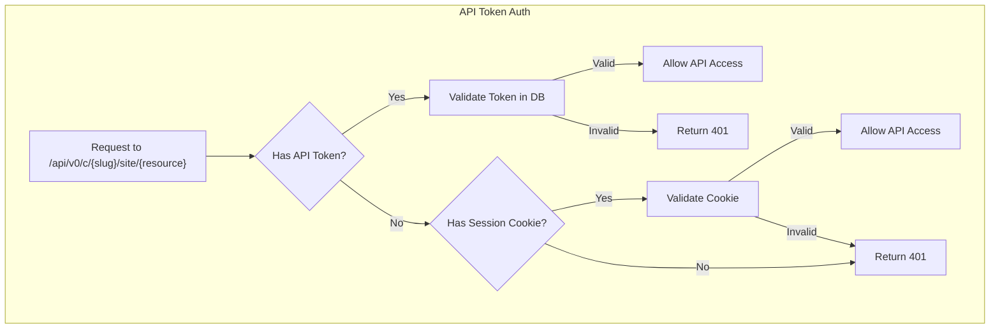

# API Authentication

API authentication (for the site api) is done through specific API Access Tokens.

```mermaid
flowchart TD
    subgraph "API Token Auth"
        B1["Request to /api/v0/c/{slug}/site/{resource}"] --> B2{Has API Token?}
        B2 -->|Yes| B3[Validate Token in DB]
        B3 -->|Valid| B4[Allow API Access]
        B3 -->|Invalid| B5[Return 401]
        B2 -->|No| B6{Has Session Cookie?}
        B6 -->|Yes| B7[Validate Cookie]
        B7 -->|Valid| B8[Allow API Access]
        B7 -->|Invalid| B9[Return 401]
        B6 -->|No| B9
    end
```
