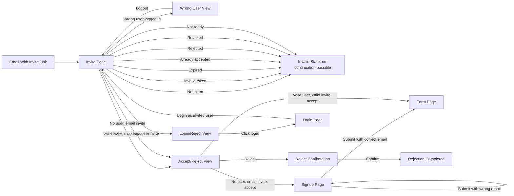

# Signup

## Email invite flow

```mermaid
flowchart LR
    A[Email With Invite Link] ---> B[Invite Page]

    B --->|No token| C[Invalid State, no continuation possible]
    B --->|Invalid token| C
    B --->|Expired| C
    B --->|Already accepted| C
    B --->|Rejected| C
    B --->|Revoked| C
    B --->|Not ready| C

    B -->|Wrong user logged in| J[Wrong User View]
    B -->|No user, user invite| L[Login/Reject View]
    B -->|Valid invite, user logged in| M[Accept/Reject View]
    B -->|No user, email invite| M
    M -->|No user, email invite, accept| N[Signup Page]

    J -->|Logout| B
    L -->|Click login| O[Login Page]

    N -->|Submit with wrong email| N
    N -->|Submit with correct email| P[Form Page]
    O -->|Login as invited user| B

    M -->|Valid user, valid invite, accept| P
    M -->|Reject| Q[Reject Confirmation]
    Q -->|Confirm| R[Rejection Completed]
```
