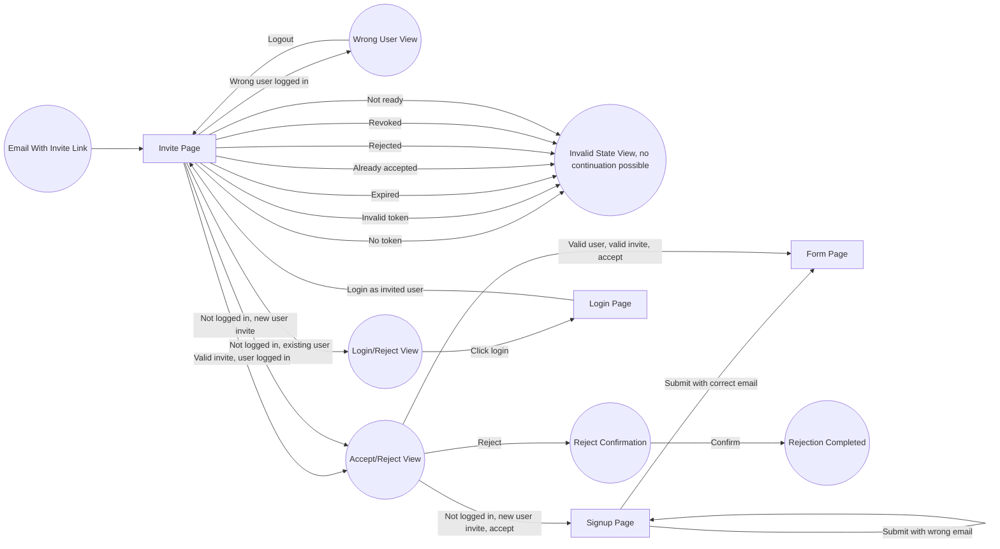

# Invites

Users can be invited to join a community, stage, or pub. This corresponds to creating a new row in the `invites` table.

Invites (as of writing 2025-04-30)

- Are for adding either new or existing users to a community
- Grant users new roles on acceptance
- Are always coupled to a user. If an invitee does not yet have an account, we will create a new account with `isProvisional` set to true. Once the user has
  accepted the invite and finished signup, the account will be marked as `isProvisional` set to false.

## Email invite flow

