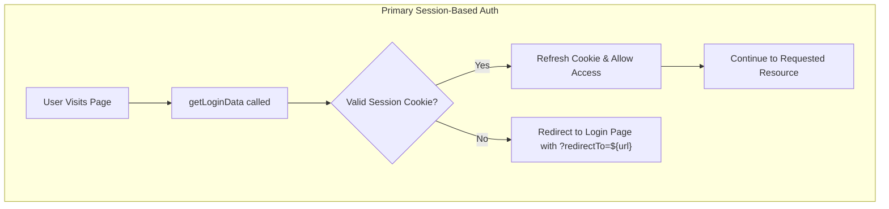
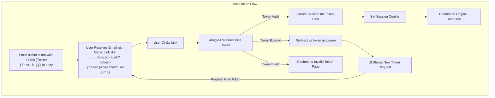
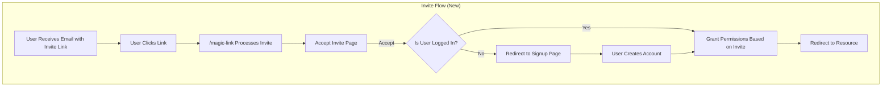
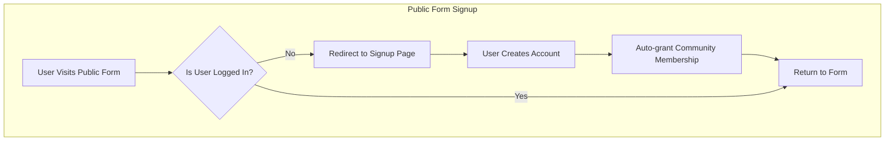

# Signup









```

    %% Shortcomings
    S1[Shortcomings]
    S1 -->|"Auth Token Flow"| S2[Confusing expired token flow]
    S1 -->|"Auth Token Flow"| S3[No clear token revocation]
    S1 -->|"All Flows"| S4[Implicit redirects]
    S1 -->|"All Flows"| S5[No email verification]
    S1 -->|"All Flows"| S6[Scattered permission granting]

    %% Historical context
    H1[Historical Context]
    H1 --> H2[Auth Tokens: Originally for integrations]
    H1 --> H3[Auth Tokens: Repurposed for hacky invites]
    H1 --> H4[Token Flow: Creates users before sending token]
    H1 --> H5[Invite Flow: Attempting to fix Token Flow issues]
```
